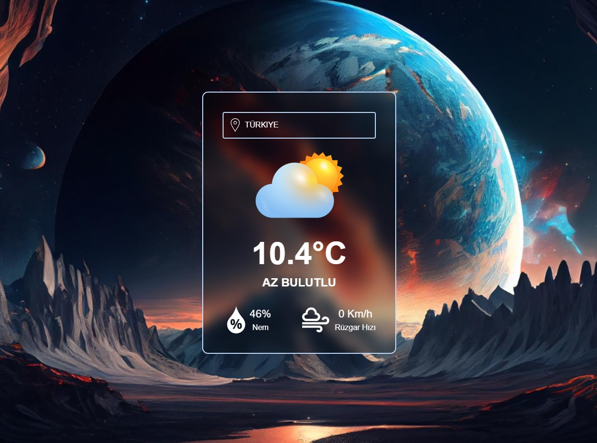

# Weather Application Using React + Vite and Tailwind.css

You can contact me for your questions and suggestions. 
If you see my mistakes and tell me, it can be very useful for me to improve.
Web : enesbilen.com
Mail : c.enesbilen@gmail.com

<h2>Library</h2>

- useState
- useEffect
- axios
- Tailwind 

<h3>Screen</h3>

<video src="https://drive.google.com/file/d/1bHYj2bPlpxoNaN2b4fPzQ0HDX5SisJcj/view?usp=sharing" controls>
  Your browser does not support the video tag.
</video>